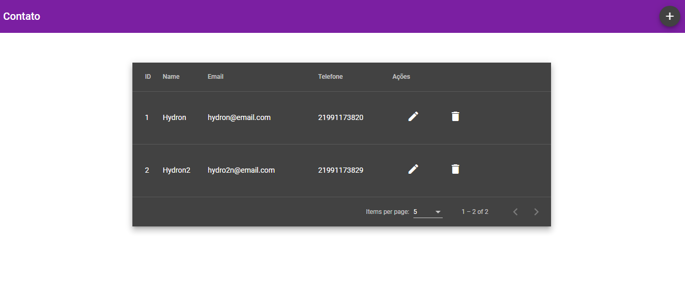
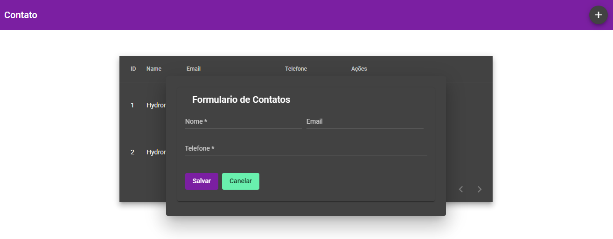
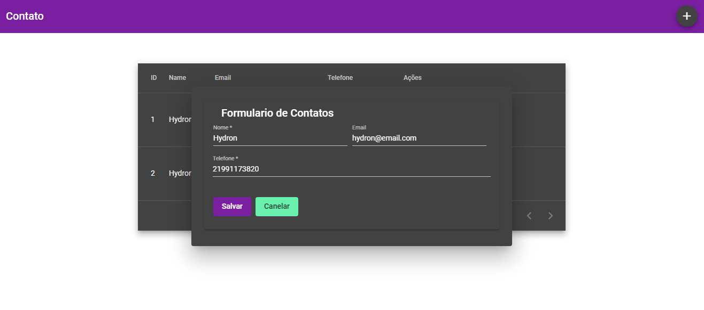
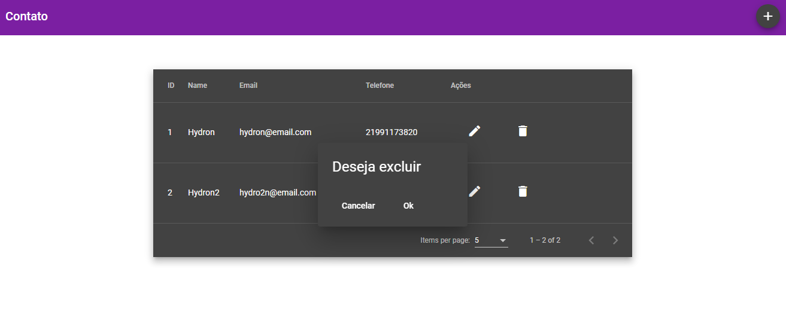

# Projeto lista de contatos com Angular 11

<table>
  <tr>
    <td>Home</td>
     <td>Tela de Inicial</td>
     <td>Tela de Novo</td>
     <td>Tela de Editar</td>
      <td>Tela de após a exclusão</td>
     <td>Tela de confirmação de exclusão</td>
     
  </tr>
  <tr>
    <td></td>
    <td></td>
    <td></td>
		<td></td>
    <td></td>
    
  </tr>
 </table>

## Installation
> Após baixa ou fazer clone do projeto, ir na pasta do mesmo roda o comando abaixo.

OS X & Linux $ Windows:
```sh
npm install ou yarn install
```

## Comando para iniciar o projeto

```sh
npm i
```

## Meta

Júlio César –  jcbarcelosrj@gmail.com

Distributed under the XYZ license. See ``LICENSE`` for more information.

[https://github.com/jcbarcelos/portifolio/tree/main/angular/listaContato](https://github.com/jcbarcelos/)
